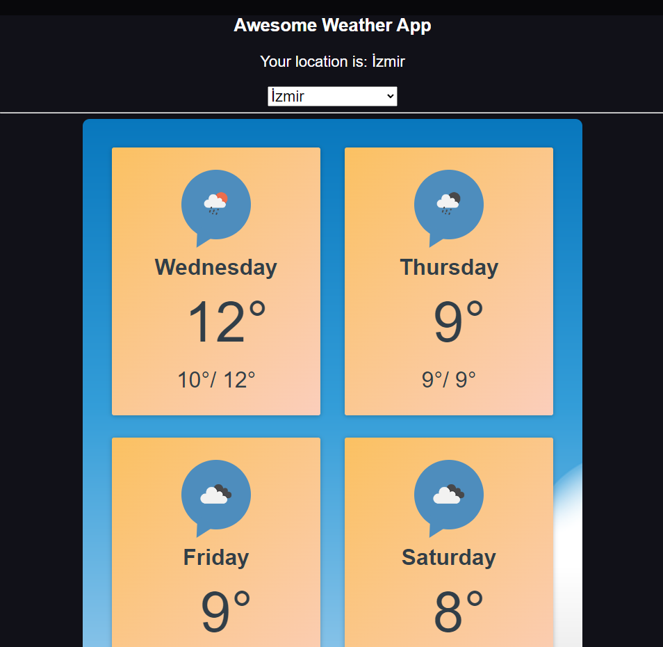

# Awesome Wheather App

## You need to get api key from openweathermap.org and change update the area is below into the ApiContex.js
 const APIKEY = "YOUR_API_KEY"; 
### `npm start`

Runs the app in the development mode.\
Open [http://localhost:3000](http://localhost:3000) to view it in your browser.

### Good Luck!